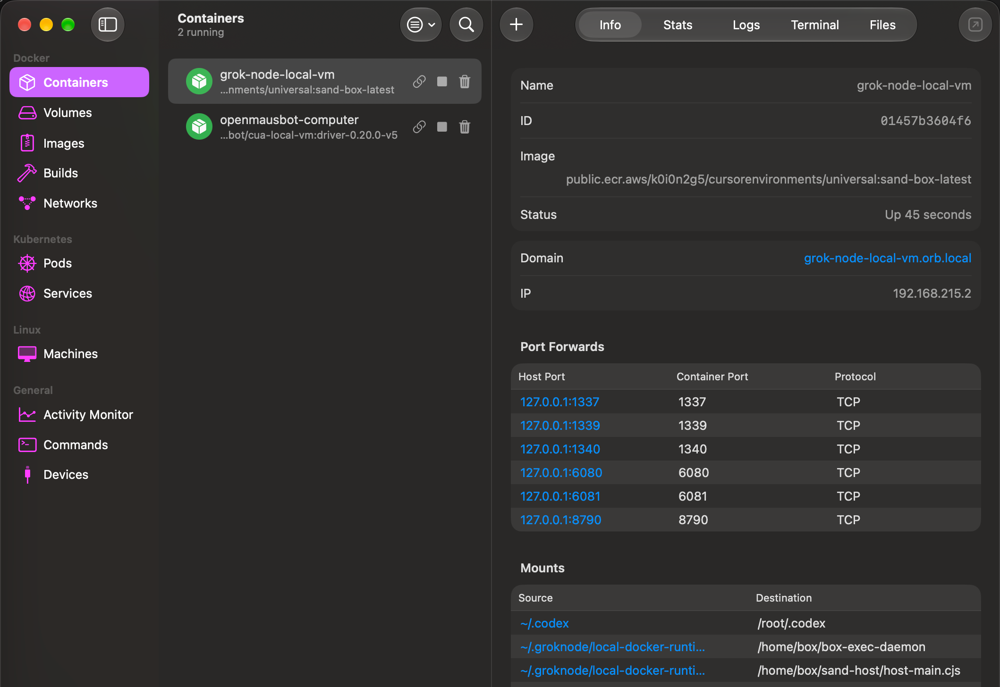

# Grok Bot 0.18 —— 重建与扩展


本仓库是对公开发布的 Grok Bot 0.18.0 macOS 应用所做的非官方、面向源码的重建。

项目最初只是为了搞清楚这个桌面应用是怎么拼装的。现在它包含 Electron、host、
coordinator、本地执行、协议与渲染层各边界的可读 TypeScript 实现，外加一条把这些
源码重新构建为可用 macOS 应用的确定性工具链。

在重建之上，项目还做了几项实用扩展：

- 推理路由（Inference Router）：支持 Codex 与 OpenRouter 两档 provider；
- 在两档路由 provider 上保留 Grok Bot 插件/MCP 工具执行；
- 路由推理的本地用量统计；
- 由应用自管的本地 Docker 沙箱（当前唯一的 box 运行时）；以及
- 融入精修版出厂 UI 的重建设置界面。

这是一个折腾与研究性质的项目，不是 Anysphere 的原始 monorepo，也不是官方 Grok Bot
发布版本。从编译产物推断出的命名与模块边界可能与原始源码不同。

## 仓库里有什么？

检入的版本树包含经过审阅的重建代码、测试、清单、构建脚本，以及用 Git LFS 保存的、
被固定（pinned）的 upstream macOS arm64 安装包。它刻意 **不** 提交解包出的 upstream
应用、构建产物、本地凭据，或庞大的取证恢复工作区。

公开发布的 Grok Bot 0.18.0 macOS arm64 应用被当作一个固定的构建输入。在 bootstrap
阶段，工具链会读取它、校验其 SHA-256，并抽取组装重建所需的部件。

产物应用在构造上是混合式的：

- 应用运行时由 `source/` 下的可读源码编译而来；
- 精修版的出厂渲染器保留为 UI 基线；
- 一小段确定性的变换负责注入重建的 Router 设置界面；
- 原始与打过补丁的渲染器分块哈希都被记录并接受校验；并且
- 成品应用使用独立的 bundle identifier 和 ad-hoc 签名。

机器上已安装的 upstream 应用永远不会被覆盖。

### 为什么保留出厂渲染器？

分发的应用包里没有原始前端源码，也没有 source map，只有优化、压缩过的生产
JavaScript 和 CSS 分块：足以观察行为、恢复契约，但拿不到手写的 React 组件、命名、
注释、文件结构和设计系统源码。

用同样的打磨度和行为把整个前端重做一遍，会是一个大得多的独立逆向工程，对一个周末
项目来说不现实。务实的选择因此是：重建运行时与控制面代码，保留被校验和固定的出厂
渲染器，并为新增的 Router 设置打上最小、可审计的 UI 补丁。

`frontend/` 是一份可读的部分重建兼设计工作区。它对理解 UI 契约、试验干净组件很有
用，但不要把它误当成 Anysphere 缺失的原始前端源码，也不要当成打包渲染器的像素级
替身。

## 固定的构建输入

确切的 upstream macOS arm64 安装包通过 Git LFS 保存在
`research-archives/original/0.18.0/` 下。它原本的公开下载地址现在已经返回 HTTP 403，
因此这份归档副本才是新克隆可以构建的前提：

| 平台 | 字节数 | SHA-256 |
| --- | ---: | --- |
| macOS arm64 | 155,793,020 | `a253ccd8aab01e083f9812a0264354c5034d8ba7f0610bbb557e82ae77d203eb` |

只有 macOS arm64 版本在范围内。Windows x64 安装包既不提供，也不需要。

机器可读的清单与校验命令见 [research-archives/README.md](research-archives/README.md)。

## 当前功能

### 推理路由（Inference Router）

打开 **Settings → Router** 选择新对话轮次使用的后端。路由提供两档 provider：

| Provider | 认证方式 | 工具支持 |
| --- | --- | --- |
| Codex | 本机已有的 ChatGPT/Codex 登录 | 直连 Responses 传输，带 Grok Bot 工具 |
| OpenRouter（UI 中显示为 TokenHub） | 通过桌面密钥桥保存的 API key | Grok Bot 工具执行循环 |

OpenRouter 是默认档。Codex 在本机已有 Codex 登录时无需额外的 API key。选择
OpenRouter/TokenHub 时，Router 页还会出现模型下拉，列出端点提供的模型，选中的模型
写入本地设置。应用在所有路由会话中保留流式响应、思考状态、表情回应、富文本插件
提及与 MCP 工具执行。

Router 页同时显示所选 provider 的本地请求与 token 累计。**Usage & Billing** 也会
汇总返回用量数据的 provider 的总量。这些数字是活动记录，不是权威的服务商账单。

### 本地 Docker 沙箱

box 运行时目前只有一个选项：本地 Docker VM，也是默认值。Grok Bot 把 box host 与
执行守护进程跑在一个由应用自管的本地容器里，不再连接任何远端沙箱。Router 页的
**Local Docker VM** 卡片显示它的状态（Ready / Starting… / Unavailable）；Shell、
文件与 computer use 都在这个容器内执行。

这个容器：

- 只绑定回环端口；
- 以只读方式挂载内容寻址（host-sha256）的 host 与守护进程产物；
- 在需要的地方复用用户已有的 provider 认证（把 `~/.codex` 只读挂进容器）；
- 在 coordinator 连接之前先通过校验；并且
- 通过同一套设置生命周期停止或替换。

容器名为 `grok-bot-local-vm`，镜像为
`public.ecr.aws/k0i0n2g5/cursorenvironments/universal:sand-box-latest`，OrbStack 把它
发布为域名 `grok-bot-local-vm.orb.local`。六个端口转发到宿主机的回环地址：

| 宿主端口 | 用途 |
| --- | --- |
| 1337 | box 执行守护进程 |
| 1339 | fork desktop router |
| 1340 | host gateway |
| 6080 | 主 noVNC 桌面 |
| 6081 | fork noVNC 桌面 |
| 8790 | egress 隧道 websocket |



Docker Desktop、OrbStack 或其他兼容的本地 Docker 守护进程必须在运行。

## 环境要求

- Apple Silicon 上的 macOS
- Node.js 26.5.x
- Xcode Command Line Tools
- Git LFS
- Docker Desktop 或兼容的本地 Docker 守护进程（本地 Docker VM 是当前唯一运行时）
- Router 两档 provider 对应的凭据：本机已有的 Codex 登录，或一个 OpenRouter API key

## 快速开始

```sh
git clone <your-repository-url>
cd GrokNode
git lfs install
git lfs pull
npm ci
npm run bootstrap
npm run check
npm run package
open "dist/Grok Node.app"
```

`npm run bootstrap` 优先使用 LFS 保存的 0.18.0 DMG 归档副本并校验其 SHA-256。归档
不存在时会回退到原始公开 URL（当前返回 HTTP 403）；也可以用 `GROK_BOT_018_APP` 指向
已有的应用副本。Bootstrap 会同时校验 DMG 与 `app.asar`，缓存匹配的 Electron 运行时，
并填充被忽略的 `src/app/dist` 构建输入。

`npm run package` 编译重建的运行时、打上窄范围的渲染器/设置补丁、创建应用 bundle、
写入重建后的 bundle identifier、进行 ad-hoc 签名并校验产物。输出在：

```text
dist/Grok Node.app
```

重建出的包在打包边界上禁用 upstream 更新器，并默认关闭 upstream 的 Sentry 与遥测
上报。显式提供的环境配置仍然生效。

## 架构

```text
精修的出厂渲染器
          │
          │ desktop preload / RPC
          ▼
     Electron main
          │
          ├── 设置、密钥、认证与插件生命周期
          └── 应用自管的本地 Docker 连接器
                       │
                       ▼
              coordinator + host
                       │
                  推理路由
          ┌────────────────────────┐
       Codex            OpenRouter(TokenHub)
          └────────────┬────────────┘
               Grok Bot MCP tools
```

主要源码区域：

- `source/electron-main/` —— 桌面生命周期、设置、认证、box 连接器、coordinator
  所有权与 RPC 处理器；
- `source/electron-preload/` —— 暴露给 UI 的窄可信桥；
- `source/host/` —— 推理、工具、MCP、设置与轮次执行；
- `source/node-agent-coordinator/` —— 转录路由、流式活动、表情回应与路由 MCP 桥；
- `source/shared/` —— 共享契约、设置、协议与 provider 辅助；
- `frontend/` —— 可读的 React/TypeScript 渲染器重建与设计工作区；
- `scripts/` —— bootstrap、编译、渲染器补丁、打包、签名与校验；以及
- `tests/` —— 发布与路由回归测试。

更多细节见 [docs/ARCHITECTURE.md](docs/ARCHITECTURE.md)。

## 开发命令

```sh
npm test                  # 聚焦回归测试
npm run typecheck         # 渲染器 TypeScript
npm run source:typecheck  # 运行时 TypeScript
npm run frontend:build    # 构建可读渲染器重建
npm run package           # 构建、签名并校验 macOS 应用
npm run verify            # 校验已打包的应用
npm run smoke             # 有界的原生冒烟检查
npm run publication:check # 证明干净历史导出无损
```

生成目录包括 `.cache`、`.build`、`dist`、`src/app/dist`、`recovered`、`recovery` 与
本地探测根目录，均不纳入版本控制。

## 项目状态

应用可以启动，核心重建链路可用，包括路由推理、已连接的插件与本地 Docker 沙箱。这
仍然是一个实验性重建：只面向一个固定的 macOS/arm64 版本，依赖外部 provider 会话，
不承诺与未来 Grok Bot 版本的兼容性。

改动请先读 [CONTRIBUTING.md](CONTRIBUTING.md)。干净历史的导出流程见
[docs/PUBLISHING.md](docs/PUBLISHING.md)。技术溯源与被保留的 upstream 边界见
[PROVENANCE.md](PROVENANCE.md) 与 [NOTICE.md](NOTICE.md)。
