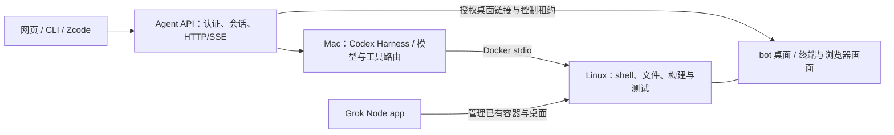

# Grok Node：可编程的 AI 开发与执行节点

**连接 AI 任务、Linux 执行环境与实时桌面，让客户端能够提交任务、检查代码改动，并在浏览器中验证结果。**

本仓库包含两条实现线：对 **Grok Bot 0.18.0 macOS 应用的非官方重建与本地化改造**，以及在其运行环境上扩展的 **GrokNode Agent API 0.3.0**。前者管理桌面应用、推理路由与本地 Docker 环境；后者将会话、任务、项目和桌面操作开放给网页、CLI 与自有客户端。

[实录](#实录) · [工程实现](#工程实现) · [架构与运行边界](#架构与运行边界) · [验证记录](#验证记录) · [快速开始](#快速开始)

## 实录

### Codex CLI：修改项目、完成自检、发布 Linux 预览

在 Codex CLI 中提交任务：**“把抽奖从「幸运三人组」改成「幸运六人组」，改动越少越好。改完运行自检，再发布到 Grok Node 预览。”**

录像保留了以下关键结果：

1. 本地项目只修改默认人数一行，由 `3` 改为 `6`，复用已有的六人布局逻辑。
2. Codex CLI 报告本地自检通过，并通过预览脚本调用 Agent API，发布到 bot 的 Linux 环境。
3. 远端健康检查通过；在 Grok Node app 中查看“全栈工程师”的电脑，刷新后显示“幸运六人组”。
4. 在真实预览中再抽一轮，实际抽出六名参与者，剩余人数由 `15` 降到 `9`。

**提交开发任务 → 本地修改与自检 → API 发布 → 远端浏览器验收**

https://github.com/user-attachments/assets/5c794fb2-0429-45d6-95c8-a1ca0b97bca7

*约 28 秒 · 中文字幕 · 无音轨；等待片段已剪短并标注。片长是剪辑后的展示时长。*

### Zcode：提交浏览器指令，核对同一运行环境

以 **Zcode** 为客户端，通过 Agent API 提交“在远程电脑上的浏览器打开 baidu.com”，由 Agent 在对应 bot 的 Linux 桌面中执行。随后切换到 Grok Node app，查看“全栈工程师”的电脑，核对两端显示的是同一个浏览器与运行环境。

**发送指令 → Linux 环境内执行 → 客户端查看画面 → Grok Node app 核对**

https://github.com/user-attachments/assets/3ad72f1d-1377-416f-95ce-2ff2b92166b2

*约 42 秒 · 中文字幕 · 无配音；等待片段以 4 倍速播放并标注。*

两段实录展示了编程客户端与桌面客户端的接入路径。下面列出这些交互背后的实现、故障处理与验证入口，便于进一步检查代码。

## 工程实现

### Agent API：从提交任务到可检查的执行结果

API 是独立服务，复用 Grok Node 已运行的 Linux 环境。Mac 上的 Codex Harness 负责模型调用、对话与工具路由，Linux 执行端负责 shell、文件修改、构建和测试。

| 工程问题 | 本项目的处理方式 | 实现与检查入口 |
| --- | --- | --- |
| 客户端与执行环境如何衔接 | HTTP/SSE 管理会话和事件；通过 Docker stdio 将执行工具接入已有 Linux 环境，连接时校验执行端与桌面状态 | [服务入口](tools/node-agent-api/server.mjs)、[共享运行时](tools/node-agent-api/shared-runtime.mjs)、[Harness](tools/node-agent-api/runtime/harness.mjs) |
| 重复提交、断线与取消如何处理 | 消息幂等键、持久事件游标、原生审批与回合结果；失联任务记录为 `unknown`，由用户决定是否重跑；取消只处理所属回合及其记录的后台进程 | [输入处理](tools/node-agent-api/input.mjs)、[回合管理](tools/node-agent-api/codex.mjs) |
| 多客户端如何观看与接管桌面 | 短期桌面票据、服务端只读输入过滤、每 bot 独占控制租约，以及接管替换与交还后的观看恢复 | [桌面控制](tools/node-agent-api/desktop.mjs)、[接管验收](docs/node-agent-api-0-3-verify/11-desktop-control.md)、[交还验收](docs/node-agent-api-0-3-verify/12-handback-view.md) |
| 项目成果如何保留与恢复 | 文件导入、Git 差异、带摘要的归档导出、项目与会话备份；恢复前校验归属、路径和摘要，网页与 CLI 可续接同一 thread | [项目与恢复实现](tools/node-agent-api/codex.mjs)、[CLI](tools/node-agent-api/client-cli.mjs)、[接口手册](docs/NODE_AGENT_API_0_3.md) |
| 模型与端点如何配置和验证 | 会话模型、bot 默认与服务默认分层；TokenHub 提供端点配置、模型拉取与测试，并区分连接验收和工具工作流验收 | [模型选择](tools/node-agent-api/models.mjs)、[TokenHub](tools/node-agent-api/tokenhub.mjs)、[验证范围](docs/node-agent-api-0-3-verify/10-tokenhub.md) |
| 接口如何保持可接入、可回归 | OpenAPI 契约、网页工作台、CLI、用户/bot 权限、配额、审计与签名 webhook；配套协议和状态回归测试 | [OpenAPI](tools/node-agent-api/openapi.json)、[测试](tests/)、[验证记录](tools/node-agent-api/VERIFICATION.md) |

完整接口按任务、模型、桌面、项目和授权组织，见 [Agent API 0.3.0 手册](docs/NODE_AGENT_API_0_3.md)。

### 桌面应用：把推理入口和执行管理接回本机

- **推理路由**：支持 Codex 与 OpenRouter（UI 名称 TokenHub），保留流式响应、工具执行、插件与 MCP；提供模型、推理强度、端点和本地用量设置。实现见 [路由配置](source/shared/node/inference-router-local.ts)、[OpenRouter 接入](source/shared/node/openrouter-proxy.ts) 与 [coordinator](source/node-agent-coordinator/)。
- **本地 Docker 执行**：应用管理容器连接与生命周期；host 与执行守护进程在 Linux 容器中运行，产物按内容哈希挂载，端口绑定本机回环地址。实现见 [Docker 连接器](source/electron-main/box/local-docker-host-connector.ts)。
- **可检查的重建与打包**：运行时由可读 TypeScript 编译；保留固定的上游渲染器，并以有锚点、可审计的补丁扩展设置界面；构建时校验输入、应用身份与产物。实现见 [构建脚本](scripts/)、[Router 补丁](scripts/lib/router-renderer-patch.mjs) 与 [技术溯源](PROVENANCE.md)。
- **独立运行身份**：使用独立的 bundle identifier、用户目录、数据根和容器名称；在打包边界禁用上游更新器，默认关闭上游 Sentry 与遥测。实现见 [应用身份](source/shared/node/grok-node-identity.ts)。

模型请求仍由所选推理服务处理。本地用量统计记录请求与 token 活动，可用于排查和观察使用情况。

## 架构与运行边界

下面是 Agent API 的主要交互路径：


```mermaid
flowchart LR
    Client[网页 / CLI / Zcode] --> API[Agent API：认证、会话、HTTP/SSE]
    API --> Harness[Mac：Codex Harness / 模型与工具路由]
    Harness -->|Docker stdio| Linux[Linux：shell、文件、构建与测试]
    API -->|授权桌面链接与控制租约| Desktop[bot 桌面 / 终端与浏览器画面]
    Linux --- Desktop
    App[Grok Node app] -->|管理已有容器与桌面| Linux
```

- **部署位置**：当前执行环境由 Mac 上的 Grok Node 管理，使用本地 Docker 容器。文中的“远程”指客户端访问 Linux 执行端及其桌面。
- **bot 关系**：各 bot 使用不同桌面，**容器和文件系统共用**。API 的用户/bot 权限控制请求范围，共享文件系统仍是现有运行边界。
- **环境生命周期**：Agent API 连接已有盒子，不自动创建、替换或重启容器，原 App 继续负责环境管理。
- **访问与恢复**：API 默认监听 `127.0.0.1`，采用 Bearer 密钥和服务端桌面授权。恢复保留的项目与会话资料后，由用户处理已中断的任务；运行中进程按中断处理。

原桌面应用的 Electron、preload、host 与推理路由关系见 [架构文档](docs/ARCHITECTURE.md)。

## 验证记录

以下是仓库中已检入、带日期和范围说明的验证证据：

| 记录 | 已记录结果 | 证据 |
| --- | --- | --- |
| 2026-10-07 Agent API 回归 | 105 通过、0 失败；覆盖模型、TokenHub、桌面控制等扩展 | [整合验证](tools/node-agent-api/VERIFICATION.md) |
| 2026-10-07 接口与文档核对 | 64 个 OpenAPI 方法/路径与手册逐项一致，文档链接及示例完成检查 | [OpenAPI](tools/node-agent-api/openapi.json)、[验证记录](tools/node-agent-api/VERIFICATION.md) |
| 共享盒子与客户端交互 | 记录了原生审批、定向取消、项目导出/恢复、网页与 CLI 同 thread，以及独立终端/浏览器窗口等验收范围 | [运行验收记录](tools/node-agent-api/VERIFICATION.md)、[桌面验证](docs/node-agent-api-0-3-verify/11-desktop-control.md) |
| 可复现的构建入口 | 锁定依赖、TypeScript 检查、回归测试、前端构建、应用打包与产物校验 | [开发命令](#开发命令)、[贡献说明](CONTRIBUTING.md) |

TokenHub 记录区分本地 fixture、模拟上游与完整工具验收；具体第三方模型的可用性需要按实际端点测试。[模型验收说明](docs/node-agent-api-0-3-verify/10-tokenhub.md)

## 快速开始

### 1. 准备仓库

开发与构建需要 Apple Silicon macOS、Node.js 26.5.x、Xcode Command Line Tools、Git LFS，以及运行中的 Docker Desktop、OrbStack 或兼容 Docker 守护进程。

```sh
git clone https://github.com/tyonger-stack/GrokNode.git
cd GrokNode
git lfs install
git lfs pull
npm ci
```

### 2. 已有 Grok Node 环境：启动 Agent API

先确认 Grok Node 的 Linux 盒子已运行，并准备好 Mac/Linux 两端 Codex 0.160.0、所需模型凭据和执行端配置；具体配置见 [安装与运行说明](tools/node-agent-api/README.md)。

```sh
npm run node-agent-api -- --backend codex --port 18770 --recover true
```

打开 [网页工作台](http://127.0.0.1:18770/ui/)，手动输入启动输出中 `owner_key_file` 指向的密钥。随后选择 bot、创建会话、提交任务并查看执行事件或桌面画面。

| 文档 | 内容 |
| --- | --- |
| [API 手册](docs/NODE_AGENT_API_0_3.md) | 前置配置、完整接口索引、请求示例、CLI、单应用 VNC 与恢复 |
| [模型选择](docs/NODE_AGENT_API_MODELS.md) | 会话模型、默认设置与普通用户可选范围 |
| [TokenHub](docs/NODE_AGENT_API_TOKENHUB.md) | 模型 API 地址、密钥、模型拉取与测试 |
| [后台运行与排障](docs/NODE_AGENT_API_OPERATIONS.md) | macOS 保活、日志、网页与桌面连接问题 |

### 3. 从源码构建 Grok Node app

桌面推理路由使用本机已有的 Codex 登录，或 OpenRouter/兼容端点的凭据。

```sh
npm run bootstrap
npm run check
npm run package
open "dist/Grok Node.app"
```

`bootstrap` 校验固定安装包与 `app.asar`，准备被忽略的构建输入。`package` 编译运行时、应用渲染器补丁、创建应用 bundle、进行 ad-hoc 签名并校验产物；输出为 `dist/Grok Node.app`。

## 开发命令

```sh
npm run check             # 前端/运行时 TypeScript 检查与回归测试
npm run frontend:build    # 构建可读前端工作区
npm run test:node-agent-api # Agent API 回归
npm run node-agent-api    # 启动 API 与网页工作台
npm run node-agent -- status BOT_ID # 指定 bot 状态；先按 API 手册配置认证
npm run package           # 构建、签名并校验 macOS 应用
npm run verify            # 校验已打包应用
npm run smoke             # 原生冒烟检查
npm run publication:check # 校验干净历史导出
```

改动前阅读 [CONTRIBUTING.md](CONTRIBUTING.md)。打包与发布流程见 [docs/PUBLISHING.md](docs/PUBLISHING.md)。

## 仓库与技术来源

| 目录 | 职责 |
| --- | --- |
| `source/electron-main/`、`source/electron-preload/` | 桌面生命周期、设置、认证与 UI 桥接 |
| `source/host/`、`source/node-agent-coordinator/` | 推理、工具、MCP、协议与回合执行 |
| `source/shared/` | 共享契约、设置及 provider 辅助 |
| `tools/node-agent-api/` | 独立 API、网页工作台、CLI、OpenAPI 契约 |
| `frontend/` | 可读的部分 React/TypeScript 重建与设计工作区 |
| `scripts/`、`tests/` | 构建与打包工具链、回归及发布检查 |
| `research-archives/` | Git LFS 保存的固定构建输入与清单 |

本项目保留并校验上游出厂渲染器基线，新增设置通过窄范围补丁注入；`frontend/` 是部分重建和设计工作区。固定的 Grok Bot 0.18.0 macOS arm64 安装包用于构建输入，清单和 SHA-256 见 [research-archives/README.md](research-archives/README.md)。从编译产物恢复的命名与模块边界可能与原源码不同。

Grok Node 使用 `com.anysphere.sand.reconstructed`、`~/Library/Application Support/Grok Node`、`~/.groknode` 和 `grok-node-local-vm` 作为独立身份；`SAND_DATA_ROOT` / `SAND_USER_DATA_DIR` 可显式覆盖默认路径。构建产物、恢复工作区、本地凭据和机器私有证据不纳入版本控制。

当前面向固定的 macOS/arm64 版本，属于研究性改造，依赖外部推理服务，不承诺后续上游版本兼容。Agent API 0.3.0 是外部适配 API，不表示兼容 OpenAI Agents SDK。技术来源与权利边界见 [PROVENANCE.md](PROVENANCE.md) 和 [NOTICE.md](NOTICE.md)。

<details>
<summary>界面与运行环境截图</summary>

Grok Node 应用截图：


Agent API 页面截图：


</details>
