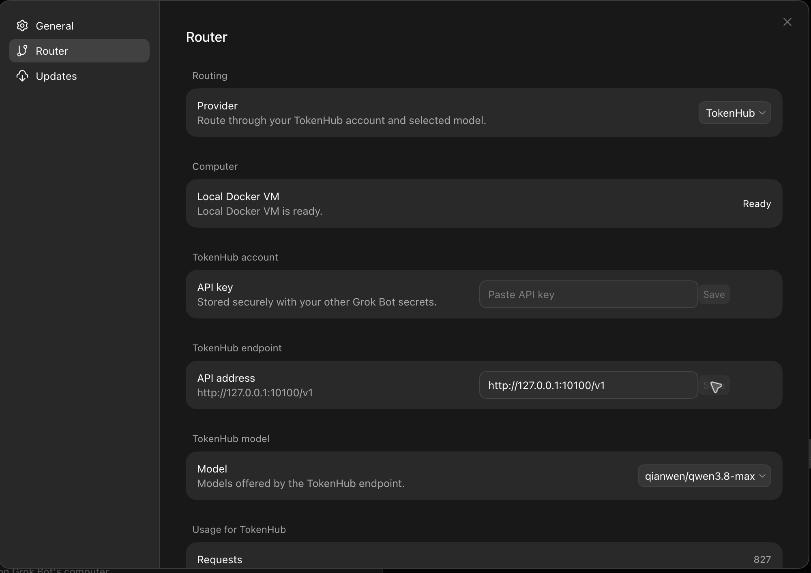
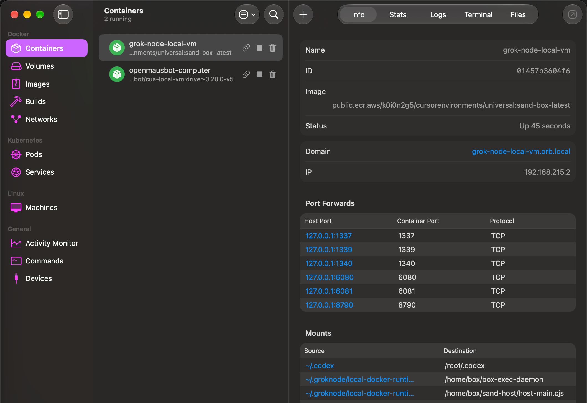

# Grok node（Grok bot 本地版）& Agent API


本仓库是对公开发布的 Grok Bot 0.18.0 macOS 应用所做的非官方本地化改造：先对桌面
应用做源码级重建，再把推理、沙箱执行、设置与用量统计全部搬回你自己的机器。

项目名 **Grok Node** 的由来也正在于此。原版应用依赖云端会话与远端沙箱；改造之后，
它像一个自足的节点（node）一样跑在本机：推理走本机已有的 Codex 登录或 OpenRouter
API key，代码执行跑在由应用自管的本地 Docker 容器里，登录态由 preload 层提供的
固定本地账户承担，打包出的应用因此命名为 `Grok Node.app`。


## Grok node 本地化改造做了什么？

- 推理路由（Inference Router）：Codex 与 OpenRouter 两档 provider，替代原有的
  云端推理入口；
- 在两档路由 provider 上保留 Grok Bot 插件/MCP 工具执行；
- 路由推理的本地用量统计，数据不出本机；
- 由应用自管的本地 Docker 沙箱，是当前唯一的 box 运行时，不再连接任何远端沙箱；
- 融入精修版出厂 UI 的重建设置界面；
- 在打包边界禁用 upstream 更新器，默认关闭 Sentry 与遥测上报。
- 设置增加默认模型的自定义推理强度，各bot也可选择模型和强度。
- 支持设置主bot。
- agent api。

改造建立在一次完整的源码级重建之上：`source/` 下是 Electron、host、
coordinator、本地执行、协议与渲染层各边界的可读 TypeScript 实现，`scripts/`
下是一条把这些源码重新构建为可用 macOS 应用的确定性工具链。

这是一个折腾与研究性质的项目，不是 Anysphere 的原始 monorepo，也不是官方 Grok Bot
发布版本。从编译产物推断出的命名与模块边界可能与原始源码不同。

## Agent API 0.3.0

**GrokNode Agent API 0.3.0** 将现有 GrokNode 的 bot、Linux 桌面和项目操作开放为本机 HTTP API，并提供网页工作台与 Codex CLI 入口。它适合连接自己的网页或薄桌面客户端：模型调用、对话和工具路由由 Mac 上的 Codex Harness 负责，shell、改文件、编译和测试进入 GrokNode 已经运行的 Linux 盒子。

| 能力 | 0.3.0 提供的接口 |
| --- | --- |
| 对话与任务 | bot 查询、独立 Harness 会话、消息、SSE 事件、回合结果、审批、定向取消 |
| 模型与端点 | 新会话选模型，管理员服务/bot 默认，TokenHub 地址、密钥、模型拉取与实际测试 |
| 桌面与单应用 | 整桌面及终端/浏览器窗口的独立观看、接管与交还；手动复制粘贴 |
| 项目与恢复 | 文件导入、Git 差异、归档导出、项目与会话备份、网页/CLI 续接同一 thread |
| 本机授权 | Bearer 密钥、用户与 bot 权限、短期桌面链接、控制租约、配额、审计、签名 webhook |

保持原 GrokNode 的定义：**各 bot 使用不同桌面，容器和数据共用**。API 是独立服务，不改原 App 的登录、启动或盒子管理逻辑，不自动创建、替换或重启容器；权限范围也不构成共享文件系统的 bot 间隔离。

已有运行中的 GrokNode 盒子，并准备好 Node 26.5.x 与 Mac/Linux 两端 Codex 0.160.0 后，在仓库根目录启动：

```sh
npm ci
npm run node-agent-api -- --backend codex --port 18770 --recover true
```

打开 [网页工作台](http://127.0.0.1:18770/ui/)，手动输入启动输出中 `owner_key_file` 指向的密钥。服务默认只监听 `127.0.0.1`；桌面链接须先通过 API 签发，观看与接管由服务端授权。

- [Node Agent API 0.3.0 详细文档](docs/NODE_AGENT_API_0_3.md)：前置配置、完整接口索引、请求示例、单应用 VNC、CLI、恢复与排障。
- [安装与运行说明](tools/node-agent-api/README.md)：执行包、代理、启动选项及运行边界。
- [模型选择与默认设置](docs/NODE_AGENT_API_MODELS.md)：默认可为空，普通用户只选获准模型。
- [TokenHub 账户与端点](docs/NODE_AGENT_API_TOKENHUB.md)：配置模型 API 地址和密钥，实际测试后授权。
- [后台运行与排障](docs/NODE_AGENT_API_OPERATIONS.md)：macOS 保活、日志及网页/桌面连接问题。
- [OpenAPI 3.0 契约](tools/node-agent-api/openapi.json)：机器可读的路径、参数、请求和响应 schema。
- [验证记录](tools/node-agent-api/VERIFICATION.md)：离线回归与真实共享盒子验证。

这是 GrokNode 的外部适配 API；版本号为 0.3.0，不表示兼容 OpenAI Agents SDK。运行中的进程按中断处理，恢复保留的文件与会话后，由用户决定重跑任务。

2026-10-07 更新包含模型与 TokenHub 扩展、桌面控制和中文标题修复；本分支的实现、测试与文档同步发布。


### 调用 Agent API 实例录像：Zcode 连接远程开发与调试环境

下面以 **Zcode** 为客户端，演示通过 **GrokNode Agent API** 接入 Grok Node 管理的 Linux 环境，提交任务并查看远程浏览器的实时画面。这段录像展示了远程开发与调试客户端的基础交互链路：**发送指令 → 环境内执行 → 查看结果**。

在 Zcode 中输入“在远程电脑上的浏览器打开 baidu.com”，由 Agent 在对应 bot 的桌面中执行浏览器操作。录像最后切换到 Grok Node app，查看“全栈工程师”的电脑，确认 Zcode 中的浏览器画面来自同一个运行环境。

https://github.com/user-attachments/assets/3ad72f1d-1377-416f-95ce-2ff2b92166b2

*约 42 秒 · 中文字幕 · 无配音；等待片段以 4 倍速播放，并在画面中标注。*

### 调用 Agent API 实例录像：codex cli连接远程开发与调试环境

下面以 Codex CLI 为客户端，演示完成本地代码修改与自检后，通过 GrokNode Agent API 将应用发布到 Grok Node 管理的 Linux 环境，并查看远程浏览器中的实际结果。这段录像展示了开发与调试的基础链路：提交任务 → 修改与自检 → 发布远程预览 → 查看结果。
在 Codex CLI 中提交“把抽奖从「幸运三人组」改成「幸运六人组」，改动越少越好”的任务，并要求完成自检和预览发布。Codex CLI 只修改默认人数一行，确认本地自检及远端健康检查通过。随后在 Grok Node app 中查看“全栈工程师”的电脑，刷新浏览器并再抽一轮，确认远程页面已变为“幸运六人组”，实际抽出六名参与者。

https://github.com/user-attachments/assets/5c794fb2-0429-45d6-95c8-a1ca0b97bca7

*约 28 秒 · 中文字幕 · 无音轨；等待片段已剪短，并在画面中标注。*

## 仓库里有什么？

检入的版本树包含经过审阅的重建代码、测试、清单、构建脚本，以及用 Git LFS 保存的、
被固定（pinned）的 upstream macOS arm64 安装包。它刻意 **不** 提交解包出的 upstream
应用、构建产物、本地凭据，或庞大的取证恢复工作区。

公开发布的 Grok Bot 0.18.0 macOS arm64 应用被当作一个固定的构建输入。在 bootstrap
阶段，工具链会读取它、校验其 SHA-256，并抽取组装重建所需的部件。

产物应用在构造上是混合式的：

- 应用运行时由 `source/` 下的可读源码编译而来；
- 精修版的出厂渲染器保留为 UI 基线；
- 一小段确定性的变换负责注入重建的 Router 设置界面；
- 原始与打过补丁的渲染器分块哈希都被记录并接受校验；并且
- 成品应用使用独立的 bundle identifier（`com.anysphere.sand.reconstructed`）和
  ad-hoc 签名。
  运行时身份同样独立：Electron 用户目录（`~/Library/Application Support/Grok Node`）、
  数据根（`~/.groknode`）与本地 Docker 容器（`grok-node-local-vm`），因此可与官方版
  Grok Bot 同时运行。显式环境变量（`SAND_DATA_ROOT` / `SAND_USER_DATA_DIR`）仍优先于
  这些默认值。

机器上已安装的 upstream 应用永远不会被覆盖。

### 为什么保留出厂渲染器？

分发的应用包里没有原始前端源码，也没有 source map，只有优化、压缩过的生产
JavaScript 和 CSS 分块：足以观察行为、恢复契约，但拿不到手写的 React 组件、命名、
注释、文件结构和设计系统源码。

用同样的打磨度和行为把整个前端重做一遍，会是一个大得多的独立逆向工程，对一个周末
项目来说不现实。务实的选择因此是：重建运行时与控制面代码，保留被校验和固定的出厂
渲染器，并为新增的 Router 设置打上最小、可审计的 UI 补丁。

`frontend/` 是一份可读的部分重建兼设计工作区。它对理解 UI 契约、试验干净组件很有
用，但不要把它误当成 Anysphere 缺失的原始前端源码，也不要当成打包渲染器的像素级
替身。

## 固定的构建输入

确切的 upstream macOS arm64 安装包通过 Git LFS 保存在
`research-archives/original/0.18.0/` 下。它原本的公开下载地址现在已经返回 HTTP 403，
因此这份归档副本才是新克隆可以构建的前提：

| 平台 | 字节数 | SHA-256 |
| --- | ---: | --- |
| macOS arm64 | 155,793,020 | `a253ccd8aab01e083f9812a0264354c5034d8ba7f0610bbb557e82ae77d203eb` |

只有 macOS arm64 版本在范围内。Windows x64 安装包既不提供，也不需要。

机器可读的清单与校验命令见 [research-archives/README.md](research-archives/README.md)。

## 当前功能

### 推理路由（Inference Router）

打开 **Settings → Router** 选择新对话轮次使用的后端。路由提供两档 provider：

| Provider | 认证方式 | 工具支持 |
| --- | --- | --- |
| Codex | 本机已有的 ChatGPT/Codex 登录 | 直连 Responses 传输，带 Grok Bot 工具 |
| OpenRouter（UI 中显示为 TokenHub） | 通过桌面密钥桥保存的 API key | Grok Bot 工具执行循环 |

OpenRouter 是默认档。Codex 在本机已有 Codex 登录时无需额外的 API key。选择
OpenRouter/TokenHub 时，Router 页还会出现模型下拉，列出端点提供的模型，选中的模型
写入本地设置。应用在所有路由会话中保留流式响应、思考状态、表情回应、富文本插件
提及与 MCP 工具执行。

选择 OpenRouter/TokenHub 时，Router 页还会出现 **API address** 卡片，可以指定任意
OpenRouter 兼容端点，留空则默认云端端点 `https://openrouter.ai/api/v1`。地址的解析
顺序为：设置中保存的值 → `OPENROUTER_BASE_URL` 环境变量 → `~/.codex/config.toml` 的
`openai_base_url`。截图中填入的是本地代理 `http://127.0.0.1:10100/v1`，模型下拉随之
列出该端点提供的模型：



Router 页同时显示所选 provider 的本地请求与 token 累计。**Usage & Billing** 也会
汇总返回用量数据的 provider 的总量。这些数字是活动记录，不是权威的服务商账单。

### 本地 Docker 沙箱

box 运行时目前只有一个选项：本地 Docker VM，也是默认值。Grok Bot 把 box host 与
执行守护进程跑在一个由应用自管的本地容器里，不再连接任何远端沙箱。Router 页的
**Local Docker VM** 卡片显示它的状态（Ready / Starting… / Unavailable）；Shell、
文件与 computer use 都在这个容器内执行。

这个容器：

- 只绑定回环端口；
- 以只读方式挂载内容寻址（host-sha256）的 host 与守护进程产物；
- 在需要的地方复用用户已有的 provider 认证（把 `~/.codex` 只读挂进容器）；
- 在 coordinator 连接之前先通过校验；并且
- 通过同一套设置生命周期停止或替换。

容器名为 `grok-node-local-vm`。应用代码引用的镜像标签是
`public.ecr.aws/k0i0n2g5/cursorenvironments/universal:sand-box-latest`；2026-09-24
已验证的镜像版本为 git-sha `12c7367`，不可变 digest 为
`sha256:f9dff5cd254d9fac936f33754b8950e50443bacffdf0fdc61cf5b23d72a82856`。复现或排障时
可以使用 `public.ecr.aws/k0i0n2g5/cursorenvironments/universal@sha256:f9dff5cd254d9fac936f33754b8950e50443bacffdf0fdc61cf5b23d72a82856`
锁定该版本；`sand-box-latest` 标签之后可能继续指向更新的镜像。OrbStack 把容器发布为域名
`grok-node-local-vm.orb.local`。六个端口转发到宿主机的回环地址：

| 宿主端口 | 用途 |
| --- | --- |
| 1337 | box 执行守护进程 |
| 1339 | fork desktop router |
| 1340 | host gateway |
| 6080 | 主 noVNC 桌面 |
| 6081 | fork noVNC 桌面 |
| 8790 | egress 隧道 websocket |



Docker Desktop、OrbStack 或其他兼容的本地 Docker 守护进程必须在运行。

## 环境要求

- Apple Silicon 上的 macOS
- Node.js 26.5.x
- Xcode Command Line Tools
- Git LFS
- Docker Desktop 或兼容的本地 Docker 守护进程（本地 Docker VM 是当前唯一运行时）
- Router 两档 provider 对应的凭据：本机已有的 Codex 登录，或一个 OpenRouter API key

## 快速开始

```sh
git clone <your-repository-url>
cd GrokNode
git lfs install
git lfs pull
npm ci
npm run bootstrap
npm run check
npm run package
open "dist/Grok Node.app"
```

`npm run bootstrap` 优先使用 LFS 保存的 0.18.0 DMG 归档副本并校验其 SHA-256。归档
不存在时会回退到原始公开 URL（当前返回 HTTP 403）；也可以用 `GROK_BOT_018_APP` 指向
已有的应用副本。Bootstrap 会同时校验 DMG 与 `app.asar`，缓存匹配的 Electron 运行时，
并填充被忽略的 `src/app/dist` 构建输入。

`npm run package` 编译重建的运行时、打上窄范围的渲染器/设置补丁、创建应用 bundle、
写入重建后的 bundle identifier、进行 ad-hoc 签名并校验产物。输出在：

```text
dist/Grok Node.app
```

重建出的包在打包边界上禁用 upstream 更新器，并默认关闭 upstream 的 Sentry 与遥测
上报。显式提供的环境配置仍然生效。

## 架构

```text
精修的出厂渲染器
          │
          │ desktop preload / RPC
          ▼
     Electron main
          │
          ├── 设置、密钥、认证与插件生命周期
          └── 应用自管的本地 Docker 连接器
                       │
                       ▼
              coordinator + host
                       │
                  推理路由
          ┌────────────────────────┐
       Codex            OpenRouter(TokenHub)
          └────────────┬────────────┘
               Grok Bot MCP tools
```

主要源码区域：

- `source/electron-main/` —— 桌面生命周期、设置、认证、box 连接器、coordinator
  所有权与 RPC 处理器；
- `source/electron-preload/` —— 暴露给 UI 的窄可信桥；
- `source/host/` —— 推理、工具、MCP、设置与轮次执行；
- `source/node-agent-coordinator/` —— 转录路由、流式活动、表情回应与路由 MCP 桥；
- `source/shared/` —— 共享契约、设置、协议与 provider 辅助；
- `frontend/` —— 可读的 React/TypeScript 渲染器重建与设计工作区；
- `scripts/` —— bootstrap、编译、渲染器补丁、打包、签名与校验；
- `tools/node-agent-api/` —— 独立的 Node Agent API、网页工作台、CLI 与 OpenAPI 契约；以及
- `tests/` —— 发布与路由回归测试。

更多细节见 [docs/ARCHITECTURE.md](docs/ARCHITECTURE.md)。

## 开发命令

```sh
npm test                  # 聚焦回归测试
npm run typecheck         # 渲染器 TypeScript
npm run source:typecheck  # 运行时 TypeScript
npm run frontend:build    # 构建可读渲染器重建
npm run package           # 构建、签名并校验 macOS 应用
npm run verify            # 校验已打包的应用
npm run smoke             # 有界的原生冒烟检查
npm run publication:check # 证明干净历史导出无损
npm run node-agent-api    # 启动独立 Node Agent API 和网页工作台
npm run test:node-agent-api # API 离线回归
```

生成目录包括 `.cache`、`.build`、`dist`、`src/app/dist`、`recovered`、`recovery` 与
本地探测根目录，均不纳入版本控制。

## 项目状态

应用可以启动，核心本地化链路可用，包括路由推理、已连接的插件与本地 Docker 沙箱。
这仍然是一个实验性改造项目：只面向一个固定的 macOS/arm64 版本，依赖外部 provider
会话，不承诺与未来 Grok Bot 版本的兼容性。

改动请先读 [CONTRIBUTING.md](CONTRIBUTING.md)。干净历史的导出流程见
[docs/PUBLISHING.md](docs/PUBLISHING.md)。技术溯源与被保留的 upstream 边界见
[PROVENANCE.md](PROVENANCE.md) 与 [NOTICE.md](NOTICE.md)。
