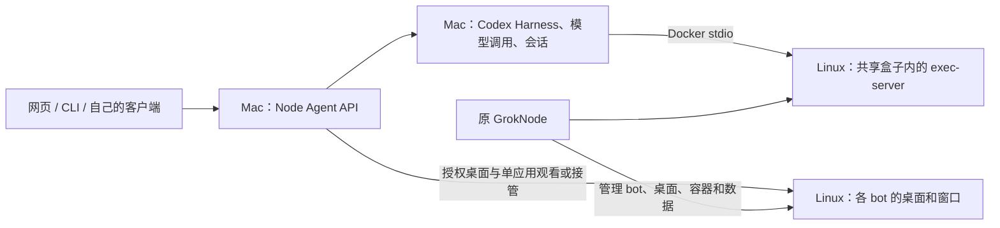

# Node Agent API 0.3.0

[返回仓库首页](../README.md) · [安装与运行说明](../tools/node-agent-api/README.md) · [OpenAPI 3.0 契约](../tools/node-agent-api/openapi.json) · [验证记录](../tools/node-agent-api/VERIFICATION.md)

Node Agent API 是运行在 Mac 上的独立适配服务。网页、CLI 和自己的客户端可以查询原 GrokNode bot、创建 Codex 会话、提交任务、查看或接管 Linux 桌面，并审查和导出项目成果。模型循环与工具路由交给 Codex Harness，执行端进入现有 GrokNode 容器。

本文对应仓库发布的 **0.3.0 共享盒子实现**。字段类型与机器可读契约见 OpenAPI；后端是否支持某项操作，启动后以 `GET /v1/capabilities` 为准。

## 目录

- [概要与架构](#概要与架构)
- [快速开始](#快速开始)
- [通用约定](#通用约定)
- [完整接口索引](#完整接口索引)
- [对话与项目示例](#对话与项目示例)
- [桌面与单应用授权](#桌面与单应用授权)
- [CLI 与恢复](#cli-与恢复)
- [多用户与 webhook](#多用户与-webhook)
- [错误与排障](#错误与排障)

## 概要与架构



| 部分 | 职责 |
| --- | --- |
| 原 GrokNode | 创建和管理 bot、分配桌面、管理共享容器与数据 |
| Node Agent API | 本机认证、会话附件、HTTP/SSE、桌面授权、项目操作与治理 |
| Mac Codex Harness | 原生 thread/turn、模型调用、工具路由和审批 |
| Linux 执行端 | shell、修改文件、编译、测试与运行应用 |

所有 bot 保持原定义：**桌面不同，容器和数据共用**。独立 Harness thread 可以区分对话，但不会隔离 Linux 文件；默认项目目录也由所有 bot 共用。API 不修改原 GrokNode 程序，不替代登录、host 或 daemon，不接管容器生命周期。

0.3.0 支持 Bearer 授权、持久事件游标、回合状态与审批、整桌面和单应用窗口、手动剪贴板、项目导入/差异/导出、备份、用户与密钥管理、配额/审计和签名 webhook。它不是 OpenAI SDK 兼容服务，trace 输出是本 API 的 JSON 记录；不承诺恢复进程内存。

## 快速开始

### 前置条件

| 项目 | 要求 |
| --- | --- |
| 宿主 | Apple Silicon Mac，Node.js 26.5.x，仓库锁定依赖 |
| 原程序 | GrokNode 已运行，已有 bot 和可用的 `grok-node-local-vm` |
| Codex | Mac CLI 与 Linux 执行包均为 0.160.0；版本不符时拒绝连接，不自动升级 |
| 模型入口 | Mac 已登录 Codex；默认代理 `http://127.0.0.1:10100/v1`，已有 `~/.codex/opencodex-catalog.json` |
| 执行包 | Linux 持久目录 `/home/box/sand-data/codex-vm/bin/codex` |

首次准备执行包，可在已运行的盒子中安装：

```sh
docker exec --user box grok-node-local-vm npm install -g @openai/codex@0.160.0 --prefix /home/box/sand-data/codex-vm
```

容器不需要复制 Mac 的 Codex 登录文件或模型密钥。此版本按连接附加 `exec-server --listen stdio`，不要求另开 `8765` WebSocket 服务。

在仓库根目录运行：

```sh
npm ci
npm run node-agent-api -- --backend codex --port 18770 --recover true
```

启动输出包含 `origin`、`ui`、`backend`、`owner_key_file`，不会打印密钥。打开 [网页工作台](http://127.0.0.1:18770/ui/)，从 `owner_key_file` 指向的本机私有文件手动取出密钥并填入网页。网页只在内存保留密钥；刷新后重新输入。直接双击 `web/index.html` 不会提供 API。

### 配置选项

| 选项 | 默认值 / 含义 |
| --- | --- |
| `--backend` | `codex`：独立 Mac Harness；`grok`：原 gateway/transcript 的 legacy 后端 |
| `--port` | `18770`；`0` 使用系统分配端口，以启动输出为准 |
| `--container` | `grok-node-local-vm`，必须是已有 GrokNode 盒子 |
| `--workspace` | `/workspace/codex-projects/node-agent-api`，可选择 `/workspace` 下的项目路径 |
| `--state` | `.lab/node-agent-shared`：API 密钥、会话、事件、治理与 artifact 状态 |
| `--runtime-state` | `.lab/shared-runtime`：Mac Codex profile、会话与备份 |
| `--namespace` | `grok-node-lab-shared`，区分 API 自己的运行资料，不用于创建额外容器 |
| `--model` / `--base-url` | 选择 Mac Harness 的模型与代理入口 |
| `--recover true` | 启动前检查并回收已死亡进程留下的服务锁；不抢占正在运行的服务 |
| `--allow-writes true` | legacy `grok` 后端的显式写策略；默认关闭，仍须满足后端安全检查 |

服务固定监听 `127.0.0.1`。`codex` 是本文示例使用的后端；legacy 后端不提供独立对话、原生取消、审批、项目和剪贴板能力，调用前应查询 capabilities。停止 API 只关闭它自己的连接与辅助进程，不停止原 GrokNode 或共享容器。

## 通用约定

### 地址与认证

默认 API 地址为 `http://127.0.0.1:18770`。REST 请求使用：

```http
Authorization: Bearer <Node Agent API key>
Content-Type: application/json
```

密钥属于 Node Agent API，不是 ChatGPT 登录文件或 GrokNode gateway token。`/health` 和 `/ui/` 静态资源无须 Bearer；桌面入口先用短期 ticket 换取 viewer cookie。其余接口均须认证，服务精确检查 Host/Origin，不提供跨域 CORS。默认实例的地址应使用 `127.0.0.1`，不能随意替换成 `localhost`、LAN 地址或 `file://`。

| 权限 | 用途 |
| --- | --- |
| `agents.read` | 读取获授权 bot |
| `agents.write` | 通过原接口创建 bot；同时要求 `bot_ids` 包含 `*` |
| `sessions.read` | 读取会话、事件、回合、项目差异和导出文件 |
| `sessions.write` | 新建会话、消息、取消、审批、项目写入和恢复 |
| `desktop.view` | 观看、读取应用列表与剪贴板 |
| `desktop.control` | 接管、交还、启动应用及手动写剪贴板 |
| `keys.manage` | 签发、轮换或撤销权限范围内的派生密钥 |

权限表中的 `+` 表示同时需要。所有会话路径还检查该会话所属 bot 是否在 `bot_ids` 授权范围内。用户和 webhook 管理仅限 owner。API grants 是访问范围，不是共享文件系统隔离。

### 标识、分页与时间

| 标识 | 来源与用途 |
| --- | --- |
| `agent_id` | 原 GrokNode bot ID，来自 bot 列表 |
| `session_id` | API 附件 ID，通常为 `nsess_*`，用于 REST 路径 |
| `thread_id` | Mac Harness 对话 ID，用于 CLI resume；不能用 session ID 替代 |
| `turn_id` | Harness 回合 ID；取消必须指定当前活动回合 |
| `application_id` | 当前 bot 桌面的 X11 窗口 ID，如 `0x…`；关闭应用后可能变化 |
| `viewer_id` / ticket | 服务签发的临时观看标识；不是 bot ID、窗口 ID 或固定桌面号 |

分页列表返回 `object: "list"`、`data`、`has_more`、`first_id`、`last_id`。支持 `limit=1..100`（默认 20）、`order=asc|desc`（默认 asc）、`after=<上一页 last_id>`。未知游标返回 `400 invalid_cursor`。`traces` 是单次列表，不使用这些分页参数。

session/event 的 `created_at`、密钥和 ticket 的 `expires_at` 为 Unix 秒。实时 turn 的 `started_at`/`ended_at`、webhook 的 `createdAt`/`nextAttemptAt` 使用 Unix 毫秒。原生 Harness item 保留其原始字段。

普通 JSON 请求上限为 64 KiB；项目导入上限为 16 MiB。消息上限为 16,000 个 JavaScript UTF-16 单元。metadata 最多 16 个字符串键值，键长最多 64，值长最多 512；`PATCH` 中 `metadata: null` 清空 metadata。

### 接受状态与任务结果

`202` 表示输入或取消已被接受，**不表示测试通过或任务完成**。session 的 `status` 描述输入接受状态；Codex 后端通过 `task_status`、`active_turn_id` 和 `/turns` 提供回合结果：`running`、`completed`、`failed`、`interrupted`、`cancelled` 或 `unknown`。

消息可使用 `Idempotency-Key` 请求头或 `idempotency_key` 字段。重试须保留同一会话、键和逻辑文本；两处同时提供时必须相同。相同输入返回保存结果，不重复执行；键相同但文本不同返回 `409 idempotency_conflict`。服务崩溃时未观察到结果的输入/回合记为 `unknown`，不会自动重发。

## 完整接口索引

以下为实际路径；`{session_id}`、`{agent_id}` 等占位符替换为接口返回的标识。所有 `/v1` 接口除表中权限外还需要 Bearer。只有声明支持相应能力的后端才能执行 Codex 专属操作。

### 服务与 bot

| 方法 | 路径 | 成功状态 | 权限 / 说明 |
| --- | --- | --- | --- |
| GET | `/health` | 200 | 无认证；服务版本与后端身份，不证明上游就绪 |
| GET | `/v1/capabilities` | 200 | 已认证；当前能力与限制 |
| GET | `/v1/usage` | 200 | 已认证；调用用户的配额计数 |
| GET | `/v1/agents` | 200 | `agents.read`；可分页，仅返回授权 bot |
| POST | `/v1/agents` | 201 | `agents.write`、所有 bot 范围、可写后端；`{name, description?}` |
| GET | `/v1/agents/{agent_id}` | 200 | `agents.read`；原 bot 资料 |

### 会话与任务

| 方法 | 路径 | 成功状态 | 权限 / 说明 |
| --- | --- | --- | --- |
| GET | `/v1/agents/sessions` | 200 | `sessions.read`；可按 `agent_id` 过滤并分页 |
| POST | `/v1/agents/sessions` | 201 / 200 | `sessions.write`；Codex 新建独立 thread；legacy 可复用已有附件 |
| GET | `/v1/agents/sessions/{session_id}` | 200 | `sessions.read`；thread、输入和任务状态 |
| PATCH | `/v1/agents/sessions/{session_id}` | 200 | `sessions.write`；替换 metadata |
| POST | `/v1/agents/sessions/{session_id}/close` | 200 | `sessions.write`；保全式关闭，活动任务须先结束或取消 |
| POST | `/v1/agents/sessions/{session_id}/resume` | 200 | `sessions.write`；重新附加 Mac Harness thread |
| POST | `/v1/agents/sessions/{session_id}/handoff` | 200 | `sessions.write`；空闲时转交同一 thread 给 CLI |
| GET | `/v1/agents/sessions/{session_id}/items` | 200 | `sessions.read`；Harness items 或 legacy transcript，可分页 |
| GET | `/v1/agents/sessions/{session_id}/turns` | 200 | `sessions.read`；Codex 回合和结果，可分页 |
| GET | `/v1/agents/sessions/{session_id}/traces` | 200 | `sessions.read`；回合、spans 与原生 token 用量，未知成本为 null |
| GET | `/v1/agents/sessions/{session_id}/events` | 200 | `sessions.read`；分页 JSON 或持久游标 SSE |
| POST | `/v1/agents/sessions/{session_id}/events` | 202 | `sessions.write`；一个消息事件或一个取消事件 |
| GET | `/v1/agents/sessions/{session_id}/actions` | 200 | `sessions.read`；待答审批，可分页 |
| POST | `/v1/agents/sessions/{session_id}/actions/{action_id}` | 200 | `sessions.write`；`{decision: "accept"\|"decline"}` |

### 桌面与应用

| 方法 | 路径 | 成功状态 | 权限 / 说明 |
| --- | --- | --- | --- |
| GET | `/v1/agents/sessions/{session_id}/environment` | 200 | `sessions.read`；当前容器和 display 映射，隐藏原 WebSocket URL |
| POST | `/v1/agents/sessions/{session_id}/desktop` | 201 | `sessions.read` + `desktop.view` 或 `desktop.control`；签发整桌面/单应用 ticket |
| POST | `/v1/agents/sessions/{session_id}/handback` | 200 | `sessions.read` + `desktop.control`；交还当前控制租约 |
| GET | `/v1/agents/sessions/{session_id}/applications` | 200 | `sessions.read` + `desktop.view`；枚举当前实际窗口 |
| POST | `/v1/agents/sessions/{session_id}/applications` | 202 | `sessions.read` + `desktop.control` + 已兑换的控制租约；`{kind: "terminal"\|"browser"}` |
| GET | `/v1/agents/sessions/{session_id}/clipboard` | 200 | `sessions.read` + `desktop.view`；手动读取 `{text}` |
| POST | `/v1/agents/sessions/{session_id}/clipboard` | 200 | `sessions.write` + `desktop.control` + 控制租约；手动写入 `{text}` |

### 项目与保全

| 方法 | 路径 | 成功状态 | 权限 / 说明 |
| --- | --- | --- | --- |
| GET | `/v1/agents/sessions/{session_id}/project/diff` | 200 | `sessions.read`；暂存、未暂存和未跟踪文件差异 |
| POST | `/v1/agents/sessions/{session_id}/project/import` | 200 | `sessions.write`；导入文本文件，拒绝覆盖已有文件 |
| POST | `/v1/agents/sessions/{session_id}/project/export` | 200 | `sessions.write`；生成 `project.tgz` artifact 描述 |
| GET | `/v1/agents/sessions/{session_id}/artifacts/{artifact_id}/content` | 200 | `sessions.read`；下载 gzip 二进制 |
| POST | `/v1/agents/sessions/{session_id}/environment/backup` | 201 | `sessions.write`；项目、Git/未提交修改、Mac 会话和日志备份 |
| POST | `/v1/agents/sessions/{session_id}/environment/restore` | 200 | `sessions.write`；`{backup_id}`，校验后恢复项目归档 |
| POST | `/v1/agents/sessions/{session_id}/environment/recreate` | 无共享后端成功响应 | `sessions.write`；共享实现返回 `409 managed_by_grok_node` |

导入、导出、备份、恢复和 CLI handoff 要求共享项目没有 API 管理的运行回合。原 GrokNode 的并发写入仍需由用户协调；API 不暂停原 bot。

### 用户、密钥与 webhook

| 方法 | 路径 | 成功状态 | 权限 / 说明 |
| --- | --- | --- | --- |
| GET | `/v1/users` | 200 | owner；用户列表，可分页 |
| POST | `/v1/users` | 201 | owner；`{name}` 新建 API 用户 |
| POST | `/v1/users/{user_id}/disable` | 200 | owner；停用用户并使其授权失效 |
| POST | `/v1/keys` | 201 | `keys.manage`；`{scopes, bot_ids, ttl_seconds?, user_id?}` |
| POST | `/v1/keys/{key_id}/rotate` | 201 | `keys.manage`；替代密钥，撤销旧密钥 |
| DELETE | `/v1/keys/{key_id}` | 200 | `keys.manage`；撤销该派生密钥及后代权限 |
| POST | `/v1/webhooks` | 201 | owner；`{destination}` 配置并启用本机投递 |
| POST | `/v1/webhooks/rotate` | 200 | owner；轮换签名密钥 |
| POST | `/v1/webhooks/dispatch` | 200 | owner；立即投递到期 outbox 项 |
| GET | `/v1/webhooks/{delivery_id}` | 200 | owner；查询属于 owner 的一次投递 |

### 查看器内部接口

客户端应打开 `/desktop` 授权响应中的 `url`，然后使用服务返回的设置，不自行拼接 viewer ID、display、token 或 WebSocket 路径。下列路由用于 noVNC 查看器，普通 REST 客户端无需逐个调用。

| 方法 | 路径 | 成功状态 | 授权 / 内容 |
| --- | --- | --- | --- |
| GET | `/desktop/open` | 303 | 单次 `ticket` 查询参数，换取 cookie 并重定向 |
| GET | `/desktop/mandatory.json` | 200 | 整桌面 viewer cookie；服务端强制设置 |
| GET | `/desktop/defaults.json` | 200 | 整桌面 viewer cookie；空默认设置 |
| GET | `/desktop/vnc.html` | 200 | 整桌面 viewer cookie；隐藏 noVNC 左侧控制条 |
| GET | `/desktop/{asset}` | 200 | 整桌面 viewer cookie；允许的静态资源 |
| GET | `/desktop/socket` | 101 | 整桌面 viewer cookie + 精确 Origin；WebSocket/RFB |
| GET | `/desktop/lane/{viewer_id}/mandatory.json` | 200 | 单应用路径 cookie；独立 socket 设置 |
| GET | `/desktop/lane/{viewer_id}/defaults.json` | 200 | 单应用路径 cookie；空默认设置 |
| GET | `/desktop/lane/{viewer_id}/vnc.html` | 200 | 单应用路径 cookie；单窗口画面 |
| GET | `/desktop/lane/{viewer_id}/{asset}` | 200 | 单应用路径 cookie；允许的静态资源 |
| GET | `/desktop/lane/{viewer_id}/socket` | 101 | 单应用路径 cookie + 精确 Origin；该窗口的 WebSocket/RFB |

## 对话与项目示例

以下命令在 **Mac 的仓库目录**中执行。示例 ID 需要替换为响应中的实际值；示例 JSON 只展示字段形状，不代表你的实时任务结果。

### 准备认证并查询 bot

```sh
NODE_AGENT_BASE='http://127.0.0.1:18770'
read -r NODE_AGENT_KEY < .lab/node-agent-shared/owner.key
node_api() {
  curl --fail-with-body --silent --show-error \
    -H "Authorization: Bearer $NODE_AGENT_KEY" \
    -H 'Content-Type: application/json' "$@"
}
node_api "$NODE_AGENT_BASE/v1/capabilities"
node_api "$NODE_AGENT_BASE/v1/agents?limit=20"
```

使用自定义 `--state` 时，从启动输出的 `owner_key_file` 读取密钥。不要把它提交到仓库、放进 URL 或复制进执行容器。

### 创建会话与提交任务

```sh
NODE_AGENT_BOT='BOT_ID_FROM_AGENTS'
node_api -X POST "$NODE_AGENT_BASE/v1/agents/sessions" \
  --data "{\"agent_id\":\"$NODE_AGENT_BOT\",\"metadata\":{\"project\":\"demo\"}}"
```

Codex 后端返回 `201`，包含 `id`、`agent_id`、`context: "codex_harness"`、`thread_id`、`task_status`。同一 bot 可有多个独立 Harness 会话；每次 POST 创建新 thread。legacy 后端可返回 `200`，复用 bot 的现有 transcript 附件。

```sh
NODE_AGENT_SESSION='SESSION_ID_FROM_RESPONSE'
node_api -X POST "$NODE_AGENT_BASE/v1/agents/sessions/$NODE_AGENT_SESSION/events" \
  -H 'Idempotency-Key: run-tests-001' \
  --data '{"events":[{"type":"message","text":"检查当前项目，修复问题并运行测试，然后说明修改。"}]}'
node_api "$NODE_AGENT_BASE/v1/agents/sessions/$NODE_AGENT_SESSION/turns"
```

接受响应形状为：

```json
{"request_id":"run-tests-001","status":"accepted","completed":false,"turn_id":"turn_example"}
```

也支持 `agent.session.input.message` 的单条 user/input_text 子集：

```json
{"events":[{"type":"agent.session.input.message","input":[{"role":"user","content":[{"type":"input_text","text":"运行测试"}]}]}],"idempotency_key":"run-tests-002"}
```

消息接口不接受客户端伪造的 tool result。需要审批的操作通过 `/actions` 回答，由 Harness 执行；不要通过重新发送消息重复执行同一请求。

### SSE、审批与取消

```sh
node_api -N -H 'Accept: text/event-stream' \
  "$NODE_AGENT_BASE/v1/agents/sessions/$NODE_AGENT_SESSION/events"
```

持久事件具有 `id: nevt_*`、`event`、JSON `data`。断线后使用最后收到的 ID：

```sh
NODE_AGENT_EVENT='LAST_PERSISTED_EVENT_ID'
node_api -N -H 'Accept: text/event-stream' -H "Last-Event-ID: $NODE_AGENT_EVENT" \
  "$NODE_AGENT_BASE/v1/agents/sessions/$NODE_AGENT_SESSION/events"
```

`Last-Event-ID` 优先于 `after` 查询参数，重连只补事件，不重放任务。`node.harness.event` 包含原生 method/params；心跳和临时上游不可用通知不代表任务结果，也不能代替持久游标。成本未知时返回 null。

```sh
node_api "$NODE_AGENT_BASE/v1/agents/sessions/$NODE_AGENT_SESSION/actions"
NODE_AGENT_ACTION='PENDING_ACTION_ID'
node_api -X POST "$NODE_AGENT_BASE/v1/agents/sessions/$NODE_AGENT_SESSION/actions/$NODE_AGENT_ACTION" \
  --data '{"decision":"decline"}'
```

`decision` 只接受 `accept` 或 `decline`。查看审批详情后再选择；回答已失效或已经处理的审批会返回冲突。

```sh
NODE_AGENT_TURN='ACTIVE_TURN_ID'
node_api -X POST "$NODE_AGENT_BASE/v1/agents/sessions/$NODE_AGENT_SESSION/events" \
  --data "{\"events\":[{\"type\":\"agent.session.input.cancel\",\"turn_id\":\"$NODE_AGENT_TURN\"}]}"
```

取消请求不带 `idempotency_key`，返回 `{accepted: true, turn_id, completed: false}`。它中断该 thread 的原生 turn，并定向终止该回合记录的后台进程；不会停止共享盒子或其他 thread。最终结果仍查询 `/turns`。

### 导入、审查与导出

```sh
node_api -X POST "$NODE_AGENT_BASE/v1/agents/sessions/$NODE_AGENT_SESSION/project/import" \
  --data '{"files":[{"path":"api-example/hello.txt","content":"Hello from Node Agent API\n"}]}'
node_api "$NODE_AGENT_BASE/v1/agents/sessions/$NODE_AGENT_SESSION/project/diff"
node_api -X POST "$NODE_AGENT_BASE/v1/agents/sessions/$NODE_AGENT_SESSION/project/export"
```

导入最多 200 个 UTF-8 文本文件，路径必须相对项目根目录；拒绝绝对路径、`..`、`.git`、符号链接穿越和覆盖已有文件。差异返回 `{diff}`，包含暂存、未暂存及未跟踪文件。导出包括项目文件和完整 Git 目录，返回 `artifact.id/name/size/sha256/download_url`；预检上限为 200 MiB、10,000 个文件。

`download_url` 是同源相对路径。复制响应里的路径并带认证下载：

```sh
NODE_AGENT_DOWNLOAD='/v1/agents/sessions/SESSION_ID/artifacts/ARTIFACT_ID/content'
node_api "$NODE_AGENT_BASE$NODE_AGENT_DOWNLOAD" --output project.tgz
shasum -a 256 project.tgz
```

将本地大小与 SHA-256 和 artifact 描述比对，再把归档保存到自己的成果目录。下载不会自动覆盖 Mac 项目。

## 桌面与单应用授权

### 整桌面观看或接管

```sh
node_api -X POST "$NODE_AGENT_BASE/v1/agents/sessions/$NODE_AGENT_SESSION/desktop" \
  --data '{"mode":"view","ttl_seconds":60,"target":{"type":"desktop"}}'
```

响应含 `url`、`display`、`expires_at`、`single_use: true`、`server_enforced: true`、`pauses_agent: false`。在本机浏览器打开 `url` 即兑换授权。`mode` 默认 `view`；接管显式指定 `control`。

ticket 默认 60 秒、最多 300 秒，且只能兑换一次。兑换后 viewer cookie 为 HttpOnly、SameSite=Strict，有效期 15 分钟。服务端过滤观看模式的键鼠输入；修改 URL 中的 `view_only` 无法获得接管权限。链接失效、服务重启或桌面映射变化后重新签发。

每 bot 同时只有一个有效控制租约。申请 ticket 尚未建立租约，必须打开链接兑换后才能启动应用或写剪贴板。接管不会暂停原 bot；用户操作和机器人动作需要自己协调。

### 终端和浏览器独立窗口

```sh
node_api "$NODE_AGENT_BASE/v1/agents/sessions/$NODE_AGENT_SESSION/applications"
```

列表返回实际窗口的 `id`、`name`、`running`。选定窗口后：

```sh
NODE_AGENT_APPLICATION='WINDOW_ID_FROM_APPLICATIONS'
node_api -X POST "$NODE_AGENT_BASE/v1/agents/sessions/$NODE_AGENT_SESSION/desktop" \
  --data "{\"mode\":\"view\",\"target\":{\"type\":\"application\",\"application_id\":\"$NODE_AGENT_APPLICATION\"}}"
```

每个单应用 viewer 使用 `/desktop/lane/{viewer_id}/…` 和独立 cookie 路径，因此可以同时打开终端与浏览器的观看窗口。要操作其中一个窗口，先交还旧控制租约，再签发该窗口的 `control` 链接。窗口 ID 会变化，不能固定旧的 `token=3` 或 `codexvm-app-3-terminal`。

没有所需应用时，先兑换该 bot 的控制链接，再明确启动：

```sh
node_api -X POST "$NODE_AGENT_BASE/v1/agents/sessions/$NODE_AGENT_SESSION/applications" \
  --data '{"kind":"terminal"}'
node_api -X POST "$NODE_AGENT_BASE/v1/agents/sessions/$NODE_AGENT_SESSION/applications" \
  --data '{"kind":"browser"}'
```

`202` 只代表启动请求接受，随后刷新应用列表取得实际窗口 ID。终端工作目录为配置的 Linux 项目，浏览器打开空白页。

### 手动剪贴板与交还

```sh
node_api "$NODE_AGENT_BASE/v1/agents/sessions/$NODE_AGENT_SESSION/clipboard"
node_api -X POST "$NODE_AGENT_BASE/v1/agents/sessions/$NODE_AGENT_SESSION/clipboard" \
  --data '{"text":"手动传入 Linux 的文本"}'
node_api -X POST "$NODE_AGENT_BASE/v1/agents/sessions/$NODE_AGENT_SESSION/handback"
```

写剪贴板要求有效控制租约，文本最多 64 KiB。网页只在用户点击按钮时传递文本，默认关闭自动同步。交还返回 `{released: true}` 并断开对应控制 viewer；关闭会话会撤销该 bot 当前的 API 桌面 ticket/viewer，撤销密钥则使相应授权链失效。

API 仅保护自身 `/v1` 和 `/desktop` 入口。原 GrokNode 的 `6080/6081` 端口保留原访问策略；访问原始 VNC 链接不会自动受到本 API 的 Bearer 权限约束。

## CLI 与恢复

### 网页与 CLI 共用 thread

在仓库根目录使用包装命令：

```sh
npm run node-agent -- status "$NODE_AGENT_BOT"
npm run node-agent -- codex "$NODE_AGENT_BOT"
```

从网页转交给 CLI，先确认共享项目空闲：

```sh
node_api -X POST "$NODE_AGENT_BASE/v1/agents/sessions/$NODE_AGENT_SESSION/handoff"
NODE_AGENT_THREAD='THREAD_ID_FROM_HANDOFF'
npm run node-agent -- resume "$NODE_AGENT_BOT" --thread "$NODE_AGENT_THREAD"
```

`handoff` 返回 `thread_id`、`bot_id`、`target: "codex_cli"`、`replayed: false`。CLI 使用与 API 相同的 namespace/runtime-state/workspace；改过这些配置时，CLI 也需传入对应的 `--namespace`、`--state-root`、`--workspace`。CLI 退出后，网页或 REST 显式恢复：

```sh
node_api -X POST "$NODE_AGENT_BASE/v1/agents/sessions/$NODE_AGENT_SESSION/resume"
node_api "$NODE_AGENT_BASE/v1/agents/sessions/$NODE_AGENT_SESSION/turns"
```

CLI 也能请求桌面和单应用的短期链接：

```sh
npm run node-agent -- desktop "$NODE_AGENT_BOT" --session "$NODE_AGENT_SESSION" --mode view
npm run node-agent -- desktop "$NODE_AGENT_BOT" --session "$NODE_AGENT_SESSION" --application "$NODE_AGENT_APPLICATION" --mode view
```

### 文件、修改、会话和日志保全

```sh
node_api -X POST "$NODE_AGENT_BASE/v1/agents/sessions/$NODE_AGENT_SESSION/environment/backup"
NODE_AGENT_BACKUP='BACKUP_ID_FROM_RESPONSE'
node_api -X POST "$NODE_AGENT_BASE/v1/agents/sessions/$NODE_AGENT_SESSION/environment/restore" \
  --data "{\"backup_id\":\"$NODE_AGENT_BACKUP\"}"
```

备份包含项目归档、Git 目录和未提交修改、Mac Codex profile/会话及 `session.json` 日志资料，返回 `backup_id`、`preserved`、`processes_restored: false`。恢复检查备份来源、项目路径和 SHA-256，并先备份当前项目，再覆盖归档内的项目条目；归档之外的新文件会保留。

**自动 restore 的范围是项目归档**。它不自动覆盖 API 的 `sessions.json` 或还原被删除的 Mac Codex profile；续接对话依赖保留的 API state、runtime-state 和原 thread。Mac 会话归档供保全与人工恢复使用，不能把项目 restore 当作整台 Mac/容器快照恢复。

服务断线或重启后，使用相同 state/runtime-state 启动并调用 `/resume`。盒子损坏时先由原 GrokNode 修复，再由 API 重新查询容器/桌面映射、恢复文件和附加 thread。执行端不可用时工具报错，不回落到 Mac shell。运行中的进程、浏览器内存和应用内存按中断处理，是否重跑由用户决定。

## 多用户与 webhook

### 用户与派生密钥

owner 可先创建 `{name}` 用户，再为该用户签发限定范围的密钥：

```json
{"user_id":"nuser_example","scopes":["agents.read","sessions.read","desktop.view"],"bot_ids":["bot_example"],"ttl_seconds":3600}
```

此请求发送到 `POST /v1/keys`，示例 ID 须替换为实际用户和 bot ID。省略 `user_id` 时属于调用者当前 API 用户。密钥默认有效 1 小时，最多 24 小时；子密钥不能扩大父权限或有效期，明文只在签发/轮换响应返回。普通派生密钥只能管理自己的后代；owner 不能通过派生密钥接口轮换或撤销 owner 身份本身。

撤销父密钥使其后代失效，轮换会撤销旧密钥及旧授权链。停用用户使其密钥、SSE 和桌面授权失效。

默认每用户限额：120 请求/分钟、4 条并发流、64 MiB 会话与 artifact 逻辑预留存储；多个属于同一用户的密钥共用计数。SSE 与桌面 WebSocket 共用流配额。审计保留有限请求元数据，不复制密钥、正文或完整对话；用 `/v1/usage` 查看计数。持久化失败时相关操作关闭，不能把 HTTP 重试视为后台已成功完成。

### webhook 签名与投递

```sh
node_api -X POST "$NODE_AGENT_BASE/v1/webhooks" \
  --data '{"destination":"http://127.0.0.1:19000/events"}'
```

接收服务须先由用户准备。webhook 默认关闭，每次 API 服务重新启动后需显式配置启用；保留的 outbox 不会自行发送。destination 仅支持数值 loopback HTTP(S) 地址，不解析 DNS、不跟随重定向。配置响应返回 `destination` 和 `signingKey: {id, secret}`，应通过本机可信方式交给接收端。

投递请求使用下列请求头：

| 请求头 | 含义 |
| --- | --- |
| `x-node-webhook-id` | delivery ID，重试保持不变 |
| `x-node-webhook-timestamp` | 数值 Unix 秒 |
| `x-node-webhook-key-id` | 当前签名 key ID |
| `x-node-webhook-signature` | `v1=<hex HMAC-SHA256>` |

签名输入是 `timestamp + "." + deliveryId + "." + exactBody`，密钥先从 base64url 解码。接收端须用原始 UTF-8 正文验签，不能重新 JSON 序列化；同时校验时间窗并持久去重 delivery ID。仓库的 `verifyWebhookSignature` 默认时间容差 300 秒，但去重仍由接收端执行。

投递语义为至少一次。默认最多 5 次尝试，指数退避从 1 秒开始、上限 60 秒，单次超时 5 秒。成功为 2xx；网络错误、408、429 和 5xx 可重试，其余状态作为失败。轮换影响下一次投递（包括重试），接收端应在交接期保留旧 key。

载荷只包含选定事件的 ID、类型、session ID、时间等元数据。通过 `/v1/webhooks/{delivery_id}` 查询 `pending`、`delivering`、`retry`、`delivered` 或 `failed`，不把 webhook 是否送达等同于任务是否成功。

## 错误与排障

REST 错误结构为：

```json
{"error":{"type":"origin_rejected","message":"Host or Origin rejected"}}
```

响应带 `X-Request-ID` 用于关联审计。WebSocket 拒绝升级时用 HTTP 状态说明认证、授权、映射或配额等错误，不使用上述 JSON 正文。

| 状态 / 常见类型 | 检查方式 |
| --- | --- |
| 400 `invalid_request` / `invalid_cursor` | 核对字段、标识、分页或 SSE 游标；不要用另一会话的游标 |
| 401 `unauthorized` | Bearer 缺失、过期、已撤销或用户已停用 |
| 401 `ticket_invalid` / `viewer_expired` | 重新申请桌面链接；ticket 已使用不能再次兑换 |
| 403 `origin_rejected` / `permission_denied` | 使用启动输出的精确 origin；检查 scope、bot grants 和控制租约 |
| 404 `not_found` / `application_not_found` | 检查 session/artifact ID，刷新实际窗口列表 |
| 409 `turn_active` / `session_busy` / `input_pending` | 等活动回合结束，或显式取消后再写项目、关闭/转交会话 |
| 409 `idempotency_conflict` | 同一请求键必须对应相同逻辑文本 |
| 409 `desktop_busy` / `desktop_changed` | 交还已有租约；重新查询桌面并签发链接 |
| 409 `managed_by_grok_node` | 原 GrokNode 管理盒子生命周期，API 不执行 recreate |
| 409 `codex_version` | 核对 Mac/Linux Codex 0.160.0，不自动升级 |
| 413 / 415 | 核对请求大小与 `application/json` |
| 429 | 查看 `/v1/usage`，关闭多余 SSE/viewer，检查配额或 outbox/ticket 容量 |
| 5xx 或后端不可用 | 检查原盒子、Mac 代理、state 权限与服务诊断；查询状态后再决定恢复或重试 |

`/health` 成功只证明 API 进程在响应，不保证模型、容器或桌面就绪。验证与边界记录见 [VERIFICATION.md](../tools/node-agent-api/VERIFICATION.md)；离线 API 回归命令为 `npm run test:node-agent-api`。
